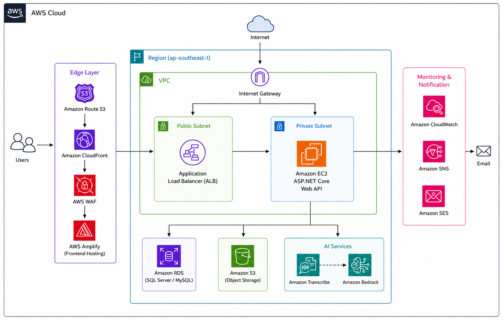

#### Giới thiệu về hệ thống

**English Study Online System** là một ứng dụng web dựa trên đám mây được thiết kế để hợp lý hóa hoạt động học tập trực tuyến và cung cấp cho học viên trải nghiệm đăng ký khóa học thuận tiện. Hệ thống cho phép học viên đăng ký, đăng nhập, duyệt các khóa học tiếng Anh có sẵn, xem thông tin giáo viên, đăng ký khóa học và theo dõi tiến trình học tập của mình. Ngoài ra, quản trị viên có thể quản lý hiệu quả giáo viên, khóa học, học viên và các lượt đăng ký thông qua một cổng quản lý tập trung.

Hệ thống được xây dựng theo mô hình **3-Tier Architecture**, giúp tách biệt giữa giao diện người dùng (Frontend), tầng xử lý nghiệp vụ (Backend) và tầng lưu trữ dữ liệu (Database). Kiến trúc này giúp ứng dụng dễ bảo trì, dễ mở rộng và nâng cao hiệu năng khi triển khai trên môi trường Cloud.

#### Tổng quan về workshop

Workshop này trình bày cách triển khai **English Study Online System** trên **Amazon Web Services (AWS)** bằng cách sử dụng nhiều dịch vụ của AWS để xây dựng một ứng dụng gốc trên đám mây an toàn, có khả năng mở rộng và có tính sẵn sàng cao.

- **Frontend Layer:** Ứng dụng ReactJS được triển khai bằng **AWS Amplify**, kết hợp với **Amazon CloudFront** để phân phối nội dung và **Amazon Route 53** để quản lý tên miền. **AWS WAF** được sử dụng để bảo vệ ứng dụng trước các cuộc tấn công phổ biến trên Web.

- **Application Layer:** Ứng dụng Backend được phát triển bằng **Spring Boot** và triển khai trên **Amazon EC2**. **Application Load Balancer (ALB)** tiếp nhận và phân phối lưu lượng truy cập đến máy chủ Backend nhằm đảm bảo tính sẵn sàng và khả năng mở rộng.

- **Data Layer:** Dữ liệu ứng dụng được lưu trữ trên **Amazon RDS (MySQL)** sử dụng cơ sở dữ liệu quan hệ, bao gồm tài khoản người dùng, giáo viên, khóa học và thông tin đăng ký.

- **Security & Monitoring:** **AWS IAM** quản lý xác thực và ủy quyền cho các tài nguyên AWS. **AWS Secrets Manager** lưu trữ an toàn các thông tin nhạy cảm. **AWS KMS** mã hóa dữ liệu nhạy cảm. **Amazon CloudWatch** giám sát hiệu suất hệ thống. **Amazon SNS** và **Amazon SES** gửi thông báo và email xác nhận đăng ký cho người dùng.

Thông qua workshop này, người đọc sẽ được hướng dẫn từng bước triển khai hệ thống từ chuẩn bị môi trường AWS, triển khai Frontend và Backend, cấu hình cơ sở dữ liệu, thiết lập các dịch vụ bảo mật, giám sát hoạt động của hệ thống, cho đến kiểm thử và dọn dẹp tài nguyên sau khi hoàn thành.

### Luồng hoạt động của hệ thống

1. **Người dùng/Giáo viên** truy cập trang web thông qua một tên miền được quản lý bởi **Amazon Route 53**.

2. **Amazon Route 53** chuyển hướng yêu cầu đến **Amazon CloudFront** để tối ưu tốc độ truy cập và phân phối nội dung.

3. **AWS WAF** kiểm tra và lọc các request trước khi đến CloudFront nhằm ngăn chặn các cuộc tấn công như SQL Injection, Cross-Site Scripting (XSS) và các request bất thường.

4. **Amazon CloudFront** phân phối giao diện ReactJS được triển khai trên **AWS Amplify** và các tài nguyên tĩnh lưu trữ trên **Amazon S3**.

5. Khi người dùng thực hiện các chức năng như đăng nhập, đăng ký khóa học hoặc quản lý dữ liệu, **Frontend (AWS Amplify)** sẽ gửi yêu cầu API đến **Application Load Balancer (ALB)**.

6. **Application Load Balancer (ALB)** chuyển tiếp các request đến máy chủ **Amazon EC2** đang chạy ứng dụng **Spring Boot Backend**.

7. **Amazon EC2** xử lý các quy trình nghiệp vụ của hệ thống như xác thực người dùng, quản lý giáo viên, khóa học, đăng ký và các chức năng khác.

8. Trong quá trình xử lý, **Amazon EC2** lưu trữ và truy xuất hình ảnh từ **Amazon S3**, đồng thời sử dụng **Amazon SES** và **Amazon SNS** để gửi email và thông báo khi cần thiết.

9. Cuối cùng, **Amazon EC2** đọc và ghi dữ liệu vào **Amazon DynamoDB**. Đồng thời, **Amazon CloudWatch** giám sát hoạt động của hệ thống và gửi cảnh báo thông qua **Amazon SNS** khi phát hiện sự cố hoặc các chỉ số vượt ngưỡng cấu hình.